# CrossSiteCookieAccessCredential

> The goal of this project is to provide a purpose-built API for enabling secure and user-mediated access to cross-site top-level unpartitioned cookies. This is accomplished with integration with the [Credential Management API](https://w3c.github.io/webappsec-credential-management/) to enable easy integration with alternative authentication mechanisms. A site that wants a user to log in calls the `navigator.credentials.get()` function with arguments defined in this spec and after appropriate user mediation and identity provider opt-in an object is returned that gives the power to obtain unpartitioned cookies for the chosen identity provider.

See https://github.com/bvandersloot-mozilla/CrossSiteCookieAccessCredential

First thoughts... it appears slightly at odds with the other purposes of the Credential Management API but if that gives this functionality a home, we're OK with it.

## IIIF Scenario

A viewer (Mirador used an example) on viewer.org wants to show access-controlled images from publisher.org. If the user is already logged in (has acquired a cookie) at publisher.org, and third party cookies are sent when viewer.org is the first party context, this is the happy path:


## IIIF with CrossSiteCookieAccessCredential (?)

The following flow requires LOSS OF STATE in Mirador, which IIIF Auth avoids:


#### Code Snippet 1

```JavaScript
let credential = await navigator.credentials.get({
  'cross-site' : {
    'allow-redirect' : true,
    'providers' : [
      {
        // Note we pass in origin as in current IIIF auth
        "auth-link" : "https://publisher.org/login?origin=viewer.org",
      },
    ]
  }
});
```

#### Code Snippet 2

```JavaScript

// flow at publisher.org has kept track of IIIF client origin
IIIF_ORIGIN = 'viewer.org';
for (let r in await navigator.credentials.crossSiteRequests.getPending()) {
  if (r.origin == IIIF_ORIGIN) {
    navigator.credentials.crossSiteRequests.allow(r);
  }
}
location.href = RETURN_TO_PAGE; // viewer.org page - how are we going to do that!!!??
```


#### Code Snippet 3

```JavaScript
let credentials = navigator.credentials.crossSiteRequests.getAllowed();
for (let credential in credentials) {
  navigator.credentials.store(credential);
  await document.requestStorageAccess("cross-site" : credential);
  
  // Now resume existing IIIF Auth flow:
  postPublisherActions();
}
```

The problem with the above is that we have LOST state. We navigated away from viewer.org to publisher.org, and then we were redirected back: `location.href = RETURN_TO_PAGE`. We need to keep our IIIF Client running while we perform the auth flow in a separate tab.

Can this work?

Does it mean that viewer.org cannot be a single page application? It needs another "page" to open in the tab? Or can it open a tab, inject DOM into it that then picks up the flow... But then what is the redirect performed by publisher.org at the end? It needs a real page to redirect to. Do Mirador, UV and other IIIF clients have to provide a page on the viewer.org domain to act as the intermediary?

## Variation with new tab, application remains running

```mermaid
sequenceDiagram
    actor User
    participant Mirador as Mirador on viewer.org
    participant Browser API
    participant Publisher as publisher.org (idp) in tab

    User->>Mirador: Want to view image.jpg
    Note left of Mirador: Here we use IIIF Auth Probe Service<br>and stored tokens (if any) to decide
    Mirador->>Mirador: Decide user is not authed
    Mirador->>Mirador: Render UI "Click to visit publisher.org"
    User->>Mirador: click()
    Mirador->>Browser API: navigator.credentials.get(..)
    note left of Browser API: (Code Snippet 4)
    Browser API->>Browser API: Render system UI
    note left of Browser API: "Browser UI is shown to the user that lets them pick<br>to link their account to the identity provider."
    User->>Browser API: click()
    Browser API->>Publisher: window.open(publisher.org/login)
    note left of Publisher: Mirador still running.<br>Publisher.org opens in new tab.
    note right of Browser API: The problem here is that our code didn't call window.open()<br>We don't have a reference to the opened tab.
    User->>Publisher: Log in
    Publisher->>Publisher: Set cookie
    Publisher->>Browser API: Navigate
    note left of Publisher: Because this flow must end with a client-side<br>location.href, there must have been at least<br>one HTTP response with a Set-Cookie<br>during this flow here?
    Publisher->>Browser API: navigator.credentials.crossSiteRequests.allow(..)
    note over Browser API,Publisher: (Code Snippet 5)
    Publisher->>Publisher: window.close()
    note right of Mirador: How do we pick up here?<br>We don't have a reference to the opened tab.
    
    Mirador->>Browser API: requestStorageAccess(..)
    note left of Browser API: (Code Snippet 6)
    Mirador->>Mirador: Render <img src="publisher.org/image.jpg" />
    Mirador-->Browser API: (process src)
    Browser API->>Publisher: GET with publisher.org cookies
    Publisher->>Publisher: Validate cookie, HTTP 200
    User->>Mirador: 👁 Can see image!
```



#### Code Snippet 4

```JavaScript
let credential = await navigator.credentials.get({
  'cross-site' : {
    'allow-redirect' : true,
    'providers' : [
      {
        // Note we pass in origin as in current IIIF auth
        "auth-link" : "https://publisher.org/login?origin=viewer.org",

        // we don't want this to replace the running web page
        "target": "_blank" // we need something like this!!!
      },
    ]
  }
});
```


#### Code Snippet 5

```JavaScript

// flow at publisher.org has kept track of IIIF client origin
IIIF_ORIGIN = 'viewer.org';
for (let r in await navigator.credentials.crossSiteRequests.getPending()) {
  if (r.origin == IIIF_ORIGIN) {
    navigator.credentials.crossSiteRequests.allow(r);
  }
}
// And again - we don't want to redirect, just close the
// interaction with the IDP, publisher.org
window.close(); 
```


#### Code Snippet 6

```JavaScript
let credentials = navigator.credentials.crossSiteRequests.getAllowed();
for (let credential in credentials) {
  navigator.credentials.store(credential);
  await document.requestStorageAccess("cross-site" : credential);
  
  // Now resume existing IIIF Auth flow:
  postPublisherActions();
}
```

## Issues

The problem with this flow is that our code didn't call window.open(), the browser internal API did. So we don't have a reference to the opened tab to poll for `null` (our sign that it has closed and we can resume flow).

Our own client code needs either a handle on the target that will soon be opened, or better, a callback:

```JavaScript

    'providers' : [
      {
        // Note we pass in origin as in current IIIF auth
        "auth-link" : "https://publisher.org/login?origin=viewer.org",
        "behavior": NEW_WINDOW,
        "callback": callMeWhenClosed
      },
    ]


    function callMeWhenClosed(args){
        // resume auth flow
    }
```